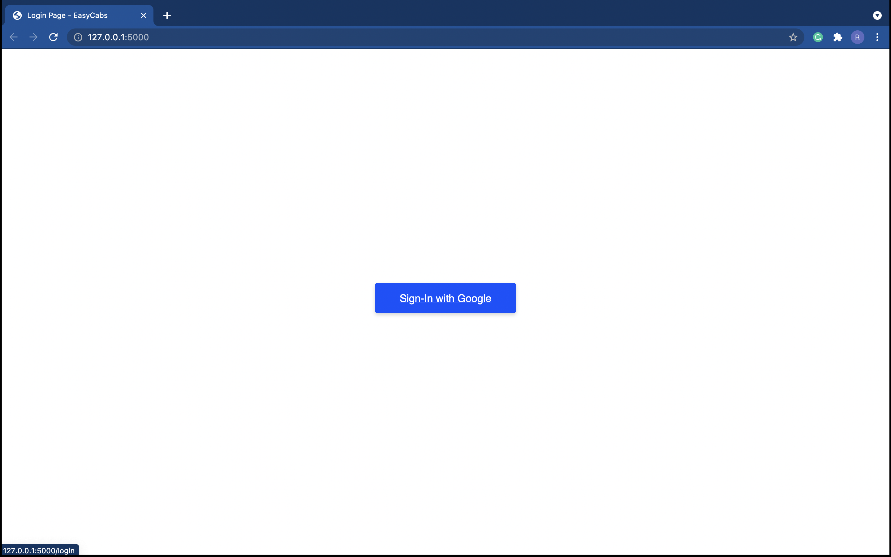
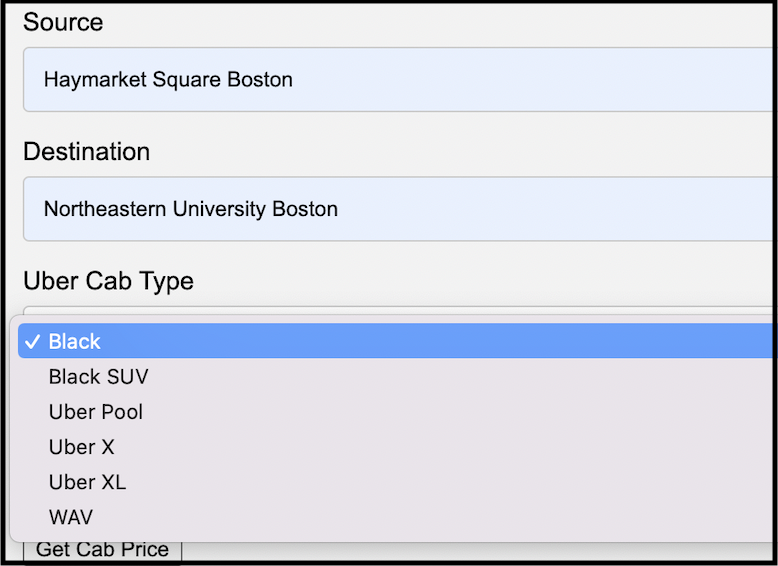
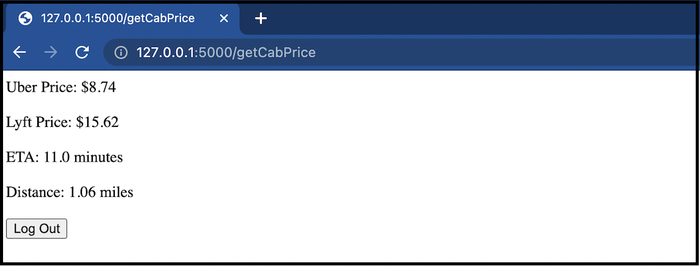

# Example document for using Easy Cabs 

## Step 1: 
Go to the [GitHub repository](https://github.com/rohitl17/cab-dynamic-pricing) and clone the repository.   

  

 

## Step 2:
Open your local terminal and create a new directory for your project (if needed) and then hit the git clone command and execute like the below screenshot.  

    
 
 
## Step 3:
There are several API dependencies needed to run this code effectively. Please read the [API documentation](../documentation/api_documentation.pdf) to see how you can get your own API credentials.  
 
 
## Step 4:
Go inside the cab-dynamic pricing folder and execute the app.py file like below.   
After successful execution, you will be prompted with a local server link, click that to proceed.   

  
 

## Step 5:
Click on the sign in with google button.  

    
  
 
## Step 6:
Please note that the access to this application is restricted among uw.edu, login using your uw id.   

 

## Step 7:
For accurate predictions in the model, kindly restrict to locations within Boston.  
Type your source and destination and select the kind of Uber and Lyft app which you would like to compare.  

   

 
 

## Step 8:
The output screen will show you the cost of the selected Uber and Lyft cab in USD along with the ETA in minutes and distance between the source and destination in miles.   

 

